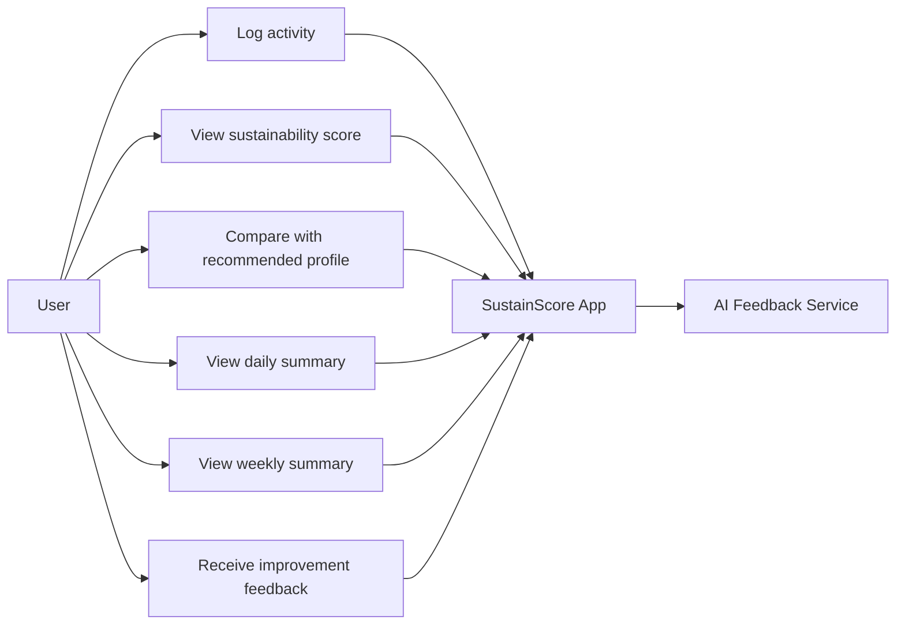

# Phase 2: Requirements

## 1. Functional Requirements

Functional requirements describe what the application must do.

### FR1: Activity Logging

The application shall allow users to log predefined sustainability-related activities.

Examples of activities include:

- Lighting usage.
- Washing machine usage.
- Computer or television usage.
- Heating or cooling usage.

Each activity log shall include the activity type, time, and quantity or duration.

### FR2: Sustainability Score Calculation

The application shall calculate a sustainability score based on the user's logged activities.

The score shall help users understand whether their daily behavior is more or less sustainable.

### FR3: Recommended Behavior Profile

The application shall generate a recommended sustainable behavior profile based on predefined target values.

The recommended profile shall be used to compare the user's actual behavior with a more sustainable scenario.

### FR4: Chart Visualization

The application shall display a chart comparing the user's actual sustainability score with the recommended score.

The chart shall help users identify high-consumption periods and understand their daily behavior patterns.

### FR5: Daily Summary

The application shall provide a daily summary of the user's sustainability performance.

The daily summary shall include the average score, high-consumption periods, and main activities affecting the score.

### FR6: Weekly Summary

The application shall provide a weekly summary showing the user's progress over multiple days.

The weekly summary shall help users understand whether their sustainability behavior is improving or worsening.

### FR7: Improvement Rate

The application shall calculate an improvement rate by comparing the user's current performance with previous performance.

The improvement rate shall show whether the user's sustainability behavior has improved, stayed stable, or declined.

### FR8: AI-Generated Feedback

The application shall generate short textual feedback based on the user's logged activities, score, summaries, and improvement rate.

The feedback shall provide practical suggestions for more sustainable habits.

### FR9: Local Data Storage

The application shall store user activity logs locally so that daily and weekly summaries can be calculated.

### FR10: Clear User Interface

The application shall provide a simple interface that allows users to log activities and view results without complex configuration.

## 2. Non-Functional Requirements

Non-functional requirements describe the quality attributes and constraints of the application.

### NFR1: Usability

The application should be easy to understand and use. A user should be able to log an activity in a small number of steps.

### NFR2: Reliability

The application should handle missing, empty, or incomplete activity data without crashing.

### NFR3: Performance

The application should calculate scores and display summaries quickly.

### NFR4: Maintainability

The application should separate the user interface, data model, scoring logic, summary logic, and AI feedback logic into clear modules.

### NFR5: Testability

The scoring, summary, and improvement-rate logic should be testable using automated unit tests.

### NFR6: Privacy

The application should avoid sending unnecessary personal data to the AI feedback component. Feedback should be generated from summarized sustainability data where possible.

### NFR7: Portability

The application should be designed so that it can run on a standard Android development environment used for the course.

### NFR8: Accessibility

The interface should use readable text, clear labels, and understandable visual elements so users can interpret their results easily.

## 3. User Stories

### US1: Log an Activity

As a user, I want to log a sustainability-related activity so that I can track my daily resource consumption.

Acceptance criteria:

- The user can select a predefined activity.
- The user can enter quantity or duration.
- The activity is saved with a time value.

### US2: View My Sustainability Score

As a user, I want to see my sustainability score so that I can understand how sustainable my behavior is.

Acceptance criteria:

- The application calculates a score from logged activities.
- The score is visible to the user.
- The score updates when new activities are added.

### US3: Compare With Recommended Behavior

As a user, I want to compare my actual behavior with a recommended profile so that I can understand how I could improve.

Acceptance criteria:

- The application shows both actual and recommended scores.
- The comparison is displayed visually.
- The user can identify where their behavior differs from the recommendation.

### US4: View Daily Summary

As a user, I want to view a daily summary so that I can understand my sustainability performance for one day.

Acceptance criteria:

- The summary shows the average score.
- The summary identifies high-consumption periods.
- The summary highlights the activities that most affected the score.

### US5: View Weekly Progress

As a user, I want to view weekly progress so that I can understand whether my habits are improving over time.

Acceptance criteria:

- The weekly view shows scores across multiple days.
- The application identifies positive or negative trends.
- The improvement rate is shown clearly.

### US6: Receive Feedback

As a user, I want to receive practical feedback so that I can improve my sustainability habits.

Acceptance criteria:

- The feedback is based on the user's logged data.
- The feedback is short and understandable.
- The feedback contains actionable suggestions.

## 4. Use-Case Diagram

## 5. MoSCoW Prioritisation

MoSCoW prioritisation is used to classify requirements as Must have, Should have, Could have, or Won't have.

### Must Have

- Activity logging.
- Sustainability score calculation.
- Recommended behavior profile.
- Basic chart visualization.
- Daily summary.
- Local data storage.
- Clear user interface.

### Should Have

- Weekly summary.
- Improvement-rate calculation.
- AI-generated feedback.
- Automated tests for scoring and summaries.
- CI/CD pipeline for automatic testing and deployment.

### Could Have

- More activity categories.
- Custom user-defined activities.
- More detailed visual analytics.
- User preferences for sustainability goals.
- Export of summary data.

### Won't Have

- Real smart-meter integration.
- Automatic appliance detection.
- Cloud synchronization.
- Multi-user accounts.
