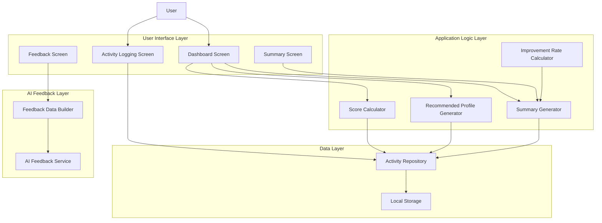
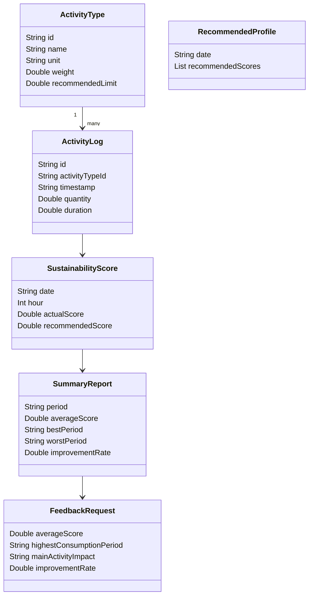

# Phase 4: Design

## 1. Architecture Diagram

SustainScore will use a modular architecture. The user interface will be separated from the application logic, data storage, and AI feedback logic.



## 2. Main Modules

### 2.1 User Interface Module

The user interface module contains the screens that the user interacts with.

Main responsibilities:

- Display the current sustainability score.
- Allow the user to log activities.
- Show actual vs. recommended behavior.
- Show daily and weekly summaries.
- Show AI-generated feedback.

Planned screens:

- `DashboardScreen`
- `LogActivityScreen`
- `SummaryScreen`
- `FeedbackScreen`

### 2.2 Data Model Module

The data model module defines the main objects used by the application.

Main responsibilities:

- Represent predefined activity types.
- Represent user activity logs.
- Represent sustainability scores.
- Represent daily and weekly summaries.
- Represent AI feedback data.

Planned classes:

- `ActivityType`
- `ActivityLog`
- `SustainabilityScore`
- `RecommendedProfile`
- `SummaryReport`
- `FeedbackRequest`

### 2.3 Scoring Module

The scoring module calculates the user's sustainability score from logged activities.

Main responsibilities:

- Calculate hourly scores.
- Apply activity weights.
- Ensure scores stay within a valid range.

Planned class:

- `ScoreCalculator`

### 2.4 Recommendation Module

The recommendation module generates a recommended sustainable behavior profile.

Main responsibilities:

- Compare user activity with recommended limits.
- Generate recommended hourly scores.
- Support actual vs. recommended chart comparison.

Planned class:

- `RecommendedProfileGenerator`

### 2.5 Summary Module

The summary module creates daily and weekly summaries.

Main responsibilities:

- Calculate average score.
- Identify high-consumption periods.
- Identify best and worst periods.
- Calculate improvement rate.

Planned classes:

- `SummaryGenerator`
- `ImprovementRateCalculator`

### 2.6 Data Storage Module

The data storage module manages local persistence.

Main responsibilities:

- Save activity logs.
- Load activity logs.
- Provide data to scoring and summary logic.

Planned class:

- `ActivityRepository`

### 2.7 AI Feedback Module

The AI feedback module prepares summarized data for feedback generation.

Main responsibilities:

- Prepare summarized input for the AI service.
- Return short actionable suggestions to the user.

Planned classes:

- `FeedbackDataBuilder`
- `AIFeedbackService`

## 3. Main Classes

| Class | Purpose |
|---|---|
| `ActivityType` | Defines a predefined activity, such as lighting or washing machine usage. |
| `ActivityLog` | Stores one user activity entry with type, time, and quantity or duration. |
| `SustainabilityScore` | Represents an actual or recommended score for a given time period. |
| `RecommendedProfile` | Represents a more sustainable behavior scenario. |
| `SummaryReport` | Stores daily or weekly summary results. |
| `ScoreCalculator` | Calculates sustainability scores from activity logs. |
| `RecommendedProfileGenerator` | Generates recommended scores for comparison. |
| `SummaryGenerator` | Creates daily and weekly summaries. |
| `ImprovementRateCalculator` | Calculates whether behavior improved or declined. |
| `ActivityRepository` | Saves and loads activity data from local storage. |
| `FeedbackDataBuilder` | Prepares summarized data for AI feedback. |
| `AIFeedbackService` | Generates textual improvement suggestions. |


## 4. UI Mockups

The following wireframes show the planned main screens. They are simple mockups and may be refined during implementation.

### 4.1 Dashboard Screen

```text
+----------------------------------+
| SustainScore                     |
+----------------------------------+
| Today Score                      |
| 78 / 100                         |
+----------------------------------+
| Actual vs Recommended Chart      |
| [hourly bar chart]               |
+----------------------------------+
| [Log Activity]  [View Summary]   |
| [Get Feedback]                   |
+----------------------------------+
```

Purpose:

- Show the user's current sustainability score.
- Show actual vs. recommended behavior.
- Provide quick access to main actions.

### 4.2 Activity Logging Screen

```text
+----------------------------------+
| Log Activity                     |
+----------------------------------+
| Activity Type                    |
| [Lighting usage v]               |
|                                  |
| Quantity / Duration              |
| [ 2 lights ]                     |
|                                  |
| Time                             |
| [ 18:00 ]                        |
+----------------------------------+
| [Save Activity]                  |
+----------------------------------+
```

Purpose:

- Allow users to log predefined sustainability-related activities.
- Keep data entry simple and fast.

### 4.3 Summary Screen

```text
+----------------------------------+
| Daily / Weekly Summary           |
+----------------------------------+
| Average Score: 78                |
| Best Period: 10:00 - 12:00       |
| Highest Consumption: 18:00       |
| Improvement Rate: +6%            |
+----------------------------------+
| Summary Chart                    |
| [daily or weekly chart]          |
+----------------------------------+
```

Purpose:

- Show the user's sustainability performance over time.
- Help the user identify patterns and progress.

### 4.4 Feedback Screen

```text
+----------------------------------+
| Improvement Feedback             |
+----------------------------------+
| Your highest consumption period  |
| was in the evening. Try reducing |
| unnecessary lighting and shorter |
| appliance usage during that time.|
+----------------------------------+
| [Back to Dashboard]              |
+----------------------------------+
```

Purpose:

- Display short, actionable AI-generated suggestions.
- Keep feedback based on summarized user data.

## 5. Data Model

The data model defines the main information used by the application.


