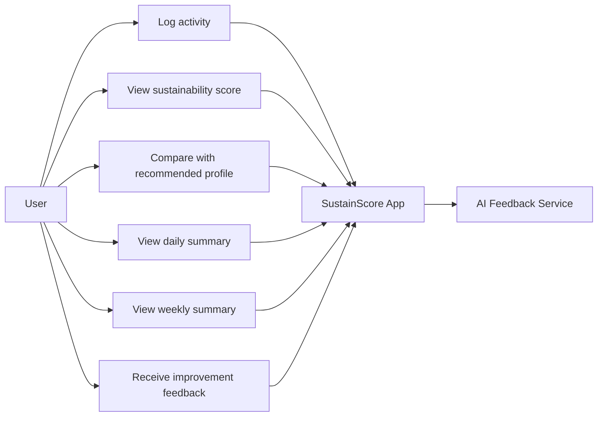

## 3. User Stories

### US1: Log an Activity

As a user, I want to log a sustainability-related activity so that I can track my daily resource consumption.

Acceptance criteria:

- The user can select a predefined activity.
- The user can enter quantity or duration.
- The activity is saved with a time value.

### US2: View My Sustainability Score

As a user, I want to see my sustainability score so that I can understand how sustainable my behavior is.

Acceptance criteria:

- The application calculates a score from logged activities.
- The score is visible to the user.
- The score updates when new activities are added.

### US3: Compare With Recommended Behavior

As a user, I want to compare my actual behavior with a recommended profile so that I can understand how I could improve.

Acceptance criteria:

- The application shows both actual and recommended scores.
- The comparison is displayed visually.
- The user can identify where their behavior differs from the recommendation.

### US4: View Daily Summary

As a user, I want to view a daily summary so that I can understand my sustainability performance for one day.

Acceptance criteria:

- The summary shows the average score.
- The summary identifies high-consumption periods.
- The summary highlights the activities that most affected the score.

### US5: View Weekly Progress

As a user, I want to view weekly progress so that I can understand whether my habits are improving over time.

Acceptance criteria:

- The weekly view shows scores across multiple days.
- The application identifies positive or negative trends.
- The improvement rate is shown clearly.

### US6: Receive Feedback

As a user, I want to receive practical feedback so that I can improve my sustainability habits.

Acceptance criteria:

- The feedback is based on the user's logged data.
- The feedback is short and understandable.
- The feedback contains actionable suggestions.

## 4. Use-Case Diagram

## 5. MoSCoW Prioritisation

MoSCoW prioritisation is used to classify requirements as Must have, Should have, Could have, or Won't have.

### Must Have

- Activity logging.
- Sustainability score calculation.
- Recommended behavior profile.
- Basic chart visualization.
- Daily summary.
- Local data storage.
- Clear user interface.

### Should Have

- Weekly summary.
- Improvement-rate calculation.
- AI-generated feedback.
- Automated tests for scoring and summaries.
- CI/CD pipeline for automatic testing and deployment.

### Could Have

- More activity categories.
- Custom user-defined activities.
- More detailed visual analytics.
- User preferences for sustainability goals.
- Export of summary data.

### Won't Have

- Real smart-meter integration.
- Automatic appliance detection.
- Cloud synchronization.
- Multi-user accounts.